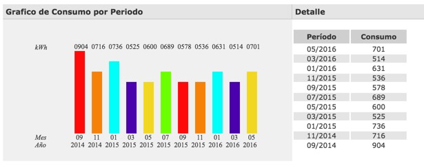

## Iluminación
* LED muchos y pequeños (e.q frente de 30 lampara con solo 100W)
  * Artefactos para difuminar, esconder y enfriar 
* Daylighting: Cenitales, quiebre de loza y tubos solares ([ver day lighting](http://en.wikipedia.org/wiki/Daylighting))
* Iluminación automática
  * Nocturna de exterior
  * De emergencia para cuando se corta la luz
  * Cortesía (escalera, áreas de transito)
  * Modo nocturno en hall PA

## Aislación térmica
* Sistema constructivo y aberturas
* Toldos mecanizados

## Climatización activa
[Ver en la sección confort](Confort.md#Temperatura_agradable)

## Paneles solares foto voltaicos
* Paneles montados sobre bloques (balasted solar mount)

## Termo-tanque solar
*  Control predictivo para minimizar el uso de la resistencia

## Electrodomésticos
* Todos clase A
* Todas las fuentes fueron reemplazadas por fuentes conmutadas